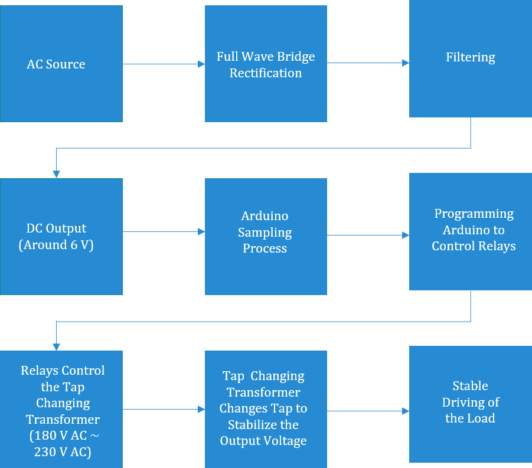
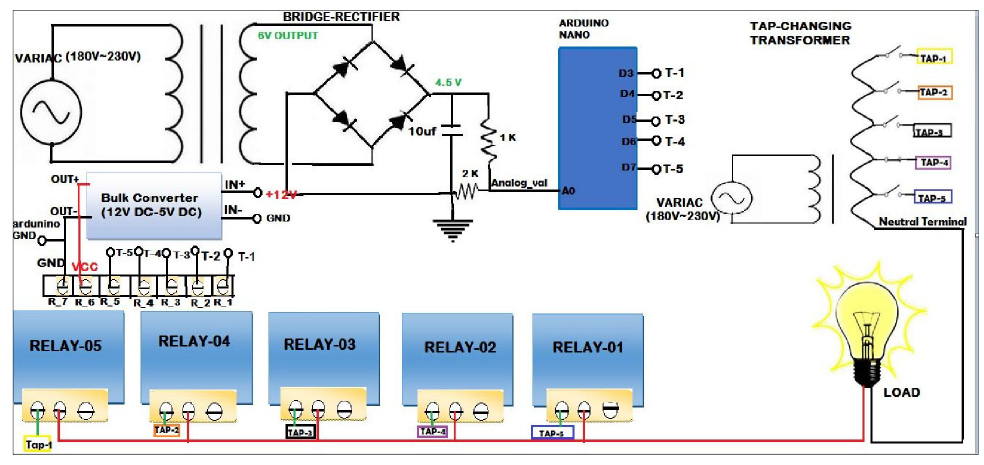

# Microcontroller Based Voltage Stabilizer
Voltage stabilizers are nowadays one of the most important requirements for all equipment. This project deals with alternative control techniques for load voltage stabilization. The technique of tap-changing transformer switched by a relay module in a coupled circuit is used. A microcontroller is used to control the switches to stabilize the load voltage against supply voltage and load current variation. Boosting or bucking effect is performed at low distortion to drive the relay module. The controlled stabilizer can reduce the supply voltage distortion and adjust the load voltage within a very short time. The technical report of this project is available at my [ResearchGate](https://www.researchgate.net/publication/318654258_Microcontroller_Based_Voltage_Stabilizer). The hardware testing video is available at my [Youtube](https://www.youtube.com/watch?v=p4Uw0DTCDqE&list=PLjNoIGauJyXgEuwqo5jd31XItulT7CI-5&index=5).

---
## Table of Contents
- [Getting Started](#getting-started)
- [Specifications of Components](#specifications-of-components)
- [Circuit Diagram](#circuit-diagram)
- [Electrical Testing Results](#electrical-testing-results)
   - [Arduino Sampling Values](#arduino-sampling-values)
   - [Tap Changing Transformer Output](#tap-changing-transformer-output)
     - [Tap-01](#tap-01) 
     - [Tap-02](#tap-01) 
     - [Tap-03](#tap-01) 
     - [Tap-04](#tap-01) 
     - [Tap-05](#tap-01) 
     - [Tap-06](#tap-01) 
     - [Tap-07](#tap-01) 

   - [Summary of Results](#summary-of-results)
- [Arduino Code](#arduino-code)
   - [Voltage Sampling Code](#voltage-sampling-code)
   - [Final Code](#final-code)
- [Hardware Pictures](#hardware-pictures)
   - [Voltage Sampling Circuit](#voltage-sampling-circuit)
   - [Wiring of the Transformer](#wiring-of-the-transformer)
   - [Wiring of the Relay Module](#wiring-of-the-relay-module)
   - [Final Hardware](#final-hardware)
  

___
## Getting Started
This project analyses a different stabilizing topology and a different design based on tapping the relay for different supply voltages. The purpose is to achieve a nearly 220V value for each variation of supply to drive the load risk freely, thus stabilizing the output voltage. 

The **process chart** is as follows: 

---
## Specifications of Components
The required **components** are as follows:

| Serial No.| Components | Specifications | Quantity |
|:---------:|:----------:|:--------------:|:--------:|
|   1.      | Diode      | 1N4007         | 4 Unit |
|   2.      | Resistor   | 1KΩ , 2KΩ      | 1 Unit Each |
|   3.      | Capacitor  | 10 uf      | 1 Unit |
|   4.      | AC Supply (VARIAC)     | 180 V ~ 230 V (50 Hz)                            | 1 Unit |
|   5.      | Transformer            | i/p : 220 V (50 Hz) ,  o/p : 6*2 V (600 mA)        | 1 Unit |
|   6.      | Tap Changing Transformer            | i/p : 180 V - 230 V (50 Hz),  o/p : 220 V (2 A)        | 1 Unit |
|   7.      | Arduino Board            | Nano       | 1 Unit |
|   8.      | Bulk Converter          | i/p : 12 V (DC) , o/p : 5 V (DC)      | 1 Unit |
|   9.      | Relay Module          | 8 Relay Module (Operating Voltage: 5V DC)    | 1 Unit |
|   10.     | LED (Red)         | 1.8 V    | 1 Unit |
|   11.     | Bread Board        |     | 1 Unit |
|   12.     | Chords and wires       |     | |
|   13.     | Digital Multimeter       |     | 1 Unit |
|   14.     | Bulb (Load)        | 60 Watt, 210 ~ 240V (50 Hz)   | 1 Unit |
---

## Circuit Diagram
